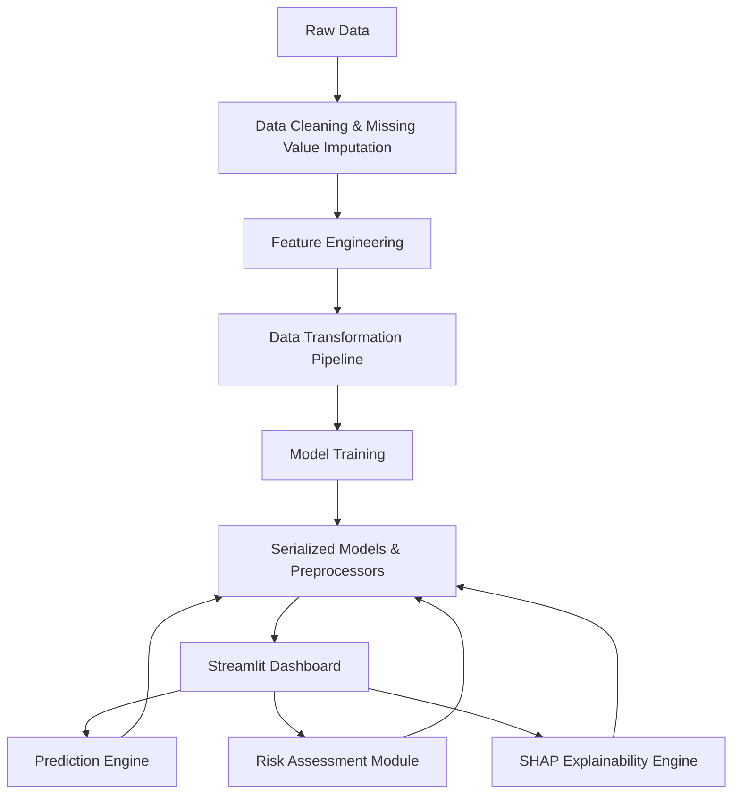

# AI-Powered Explainable Loan Approval & Credit Risk Assessment System

## Problem Statement
Financial institutions need reliable, transparent, and accurate models to predict loan approval while assessing applicant risk. Traditional ML models act as "black boxes," making it difficult for loan officers to justify decisions. This system provides a production-grade ML solution with SHAP-based explainability, business-focused risk metrics, and an interactive dashboard.

## Project Highlights
- **Explainable AI-based Loan Approval and Credit Risk Assessment System** using Random Forest, XGBoost, SHAP, and Streamlit.
- **Engineered financial risk indicators** and intelligent approval workflows, improving model interpretability and business usability.
- **Built a production-ready fintech analytics dashboard** supporting real-time loan approval prediction, confidence estimation, and risk scoring.
- **Implemented model explainability using SHAP** to provide transparent feature-level reasoning for every approval decision.

## Methodology
1. **Data Cleaning & Feature Engineering:** Automated missing value imputation, handled categorical encoding, and created custom financial features like `Income_Strength_Score`, `Loan_Burden_Ratio`, and `Financial_Stability_Index`.
2. **Model Training & Evaluation:** Trained Logistic Regression, Decision Tree, Random Forest, SVM, and XGBoost models. Evaluated using Accuracy, Precision, Recall, F1 Score, and ROC-AUC.
3. **Explainability Engine:** Utilized SHAP for global feature importance and local instance-level explainability (waterfall plots).
4. **Risk Intelligence Module:** Developed a custom algorithm to translate prediction probabilities into a 0-100 Risk Score with distinct risk categories.

## Architecture Diagram


## Project Structure
- `data/` : Dataset and background data for SHAP.
- `notebooks/` : Exploratory Data Analysis (EDA).
- `models/` : Serialized preprocessors, feature names, and best performing ML models.
- `reports/` : Historical prediction logs and JSON evaluation metrics.
- `src/` : Source code for data processing, training, prediction, and explainability.
- `dashboard/` : Streamlit dashboard page modules.
- `app.py` : Main Streamlit application entry point.

## How to Run

1. **Install Dependencies:**
   ```bash
   pip install -r requirements.txt
   ```

2. **Run the Streamlit Dashboard:**
   ```bash
   streamlit run app.py
   ```

3. *(Optional)* **Retrain Models:**
   ```bash
   python src/training.py
   ```
